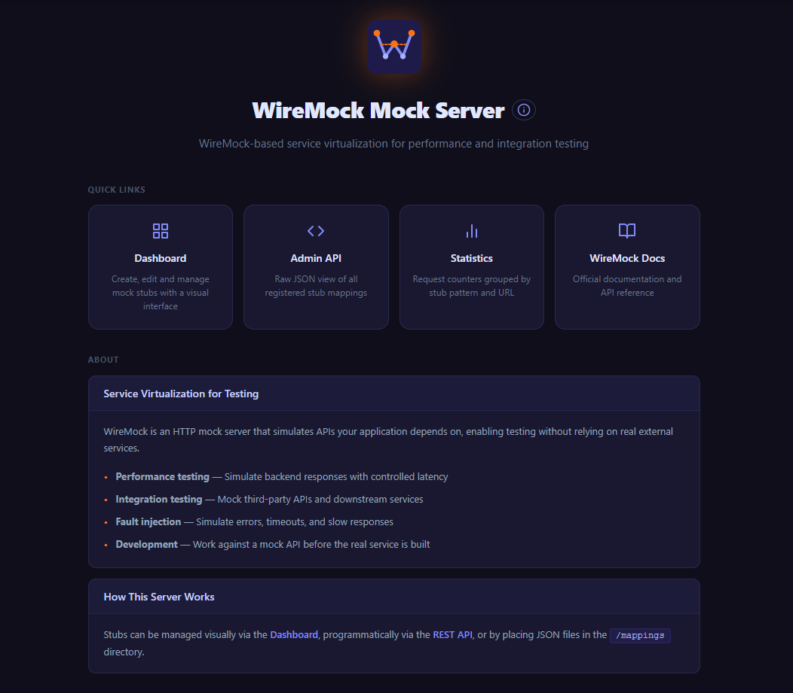
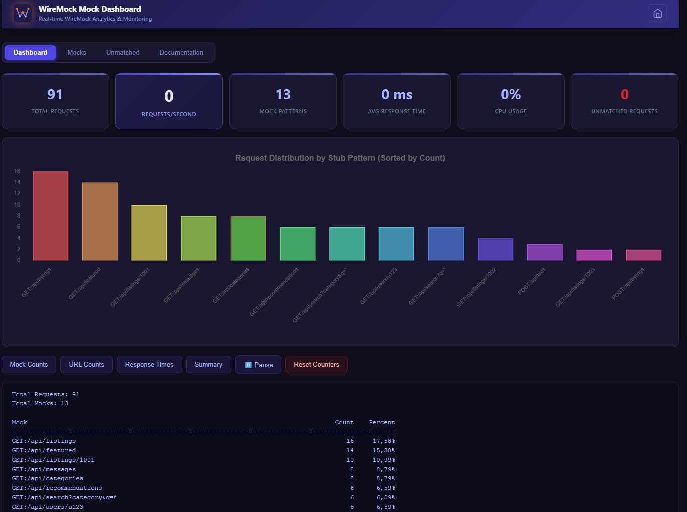
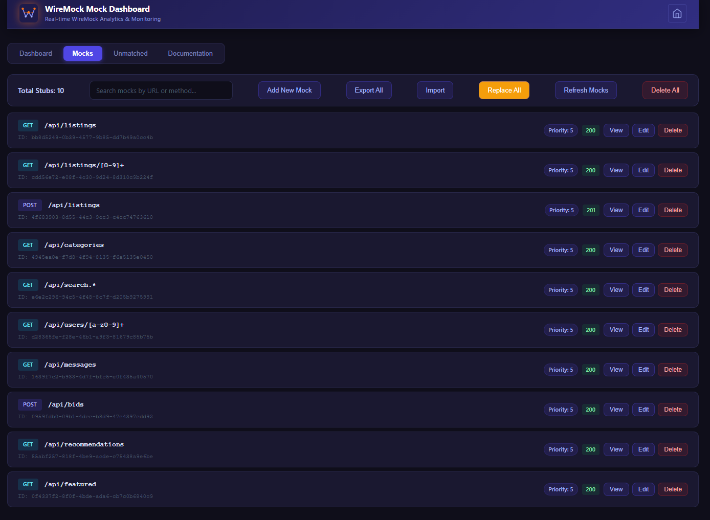

# wiremock-dashboard

WireMock with a visual dashboard for managing stubs, request analytics, and Prometheus metrics.

## Screenshots







## Quick start

**Docker**
```bash
docker run -p 8080:8080 ostberg/wiremock-dashboard
```

**Local**
```bash
mvn clean install
java -jar target/wiremock-dashboard-0.0.1-jar-with-dependencies.jar
```

Dashboard available at `http://localhost:8080/__admin/dashboard`

## Features

- Visual stub manager — create, edit, delete, import/export
- Request hit counters per stub and URL
- Response time tracking (min / avg / max)
- Unmatched request log with one-click stub creation
- Prometheus metrics at `/metrics`
- JVM metrics at `/__admin/server-metrics`

## Flags

- port: 8080
- enable-browser-proxying: false
- disable-banner: false
- no-request-journal: true
- verbose: false
- jetty-accept-queue-size: 100
- jetty-acceptor-threads: 4
- jetty-header-buffer-size: 16384

## Admin API

| Method | Endpoint | Description |
|--------|----------|-------------|
| `GET` | `/__admin/dashboard` | Dashboard UI |
| `GET/POST/DELETE` | `/__admin/mappings` | Manage stubs |
| `GET` | `/__admin/stub-counter` | Hit counts per stub |
| `GET` | `/__admin/response-times` | Response time stats |
| `POST` | `/__admin/reset-stub-counter` | Reset counters |
| `GET` | `/__admin/unmatched-requests` | Unmatched request log |
| `GET` | `/metrics` | Prometheus metrics |

## Tech

Java 21 · WireMock 3.13.0 · Maven

---

[GitHub](https://github.com/ostbergjohan)
